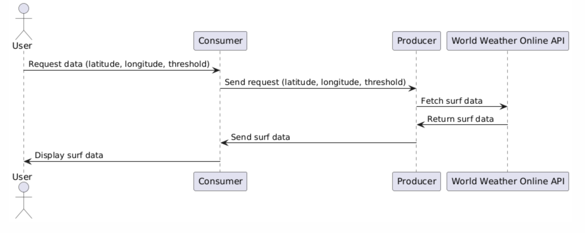

# Surf Condition Tracker Microservice

## Overview

This Surf Condition Tracker Microservice allows users to request surf condition data, including swell heights, for a specific location based on latitude and longitude. Users can receive detailed swell data, track the number of days with swells above a certain height, and receive notifications when swells exceed a specified threshold.

## Requirements

- Python 3.x
- ZeroMQ library
- Requests library
- World Weather Online API key 

## Installation

1. Clone the repository to your local machine:
    ```bash
    git clone https://github.com/shushannap/surf-condition-tracker.git
    ```
2. Navigate to the project directory:
    ```bash
    cd surf-condition-tracker
    ```
3. Set up a virtual environment and activate it:
    ```bash
    python3 -m venv venv
    source venv/bin/activate
    ```
4. Install the required dependencies:
    ```bash
    pip install -r requirements.txt
    ```

## How to Use

### Running the Microservice

1. Start the producer service:
    ```bash
    python3 producer.py
    ```
    This will start the producer service and wait for incoming requests.

2. In a separate terminal window, start the consumer service:
    ```bash
    python3 consumer.py
    ```
    This will send requests to the producer and display the received data.

### Example Request

The consumer service sends a request for swell data for a specific location. Here's how you can change the request parameters:

The below request wants swell data from Malibu, CA for a swell threshold of at least 0.5 meters. 
```python
def main():
    latitude = 34.0259
    longitude = -118.7798
    threshold = 0.5

    response = request_swell_data(latitude, longitude, threshold)
    print("Response received:")
    print(response)
```

<br><br>


The above image was created using PlantUML.


<br><br><br>

## Get Latitude and Longitude by City Name (OPTIONAL)

To make it easier for users to get the latitude and longitude based on city names, you can use the `city_lookup.py` script.

### Setup

1. **Install requests library**:
    ```bash
    pip install requests
    ```

2. **Get OpenCage API Key**:
    - Sign up at [OpenCage Geocoding API](https://opencagedata.com/api) and get your API key.

### Usage

1. Update the `city_lookup.py` file with your OpenCage API key:
    ```python
    api_key = "YOUR_OPENCAGE_API_KEY" # You can get a free API from OpenCage, but if unable, let me know and I can provide you with a key.
    ```

2. Run the script to get the latitude and longitude for a city:
    ```bash
    python3 city_lookup.py
    ```

3. Example output:
    ```
    Latitude: 34.0259, Longitude: -118.7798
    ```
